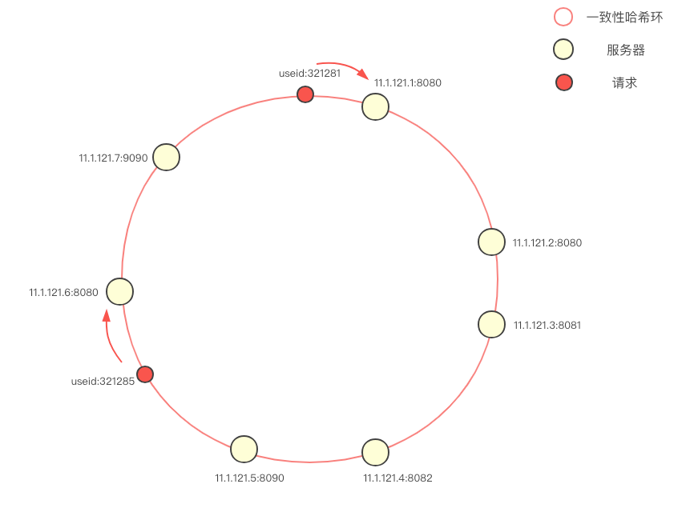
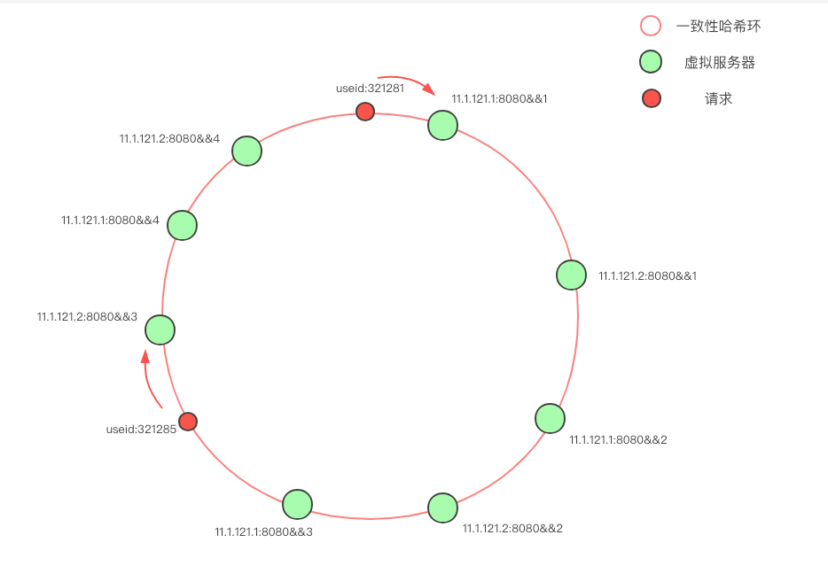

### 一致性哈希

负载均衡这个概念可以抽象为：从 n 个候选服务器中选择一个进行通信的过程
负载均衡算法有多种多样的实现方式：随机、轮询、最小负载优先等；
一致性哈希负载均衡。一致性哈希负载均衡需要保证的是“相同的请求尽可能落到同一个服务器上”；
“相同的请求” — 什么是相同的请求？一般在使用一致性哈希负载均衡时，需要指定一个 key 用于 hash 计算，可能是：
   * 请求方 IP
   * 请求服务名称，参数列表构成的串
   * 用户 ID

"尽可能" ：服务器存在上下线的情况，所以少数服务器的变化不应该影响大多数的请求

一致性哈希负载均衡的算法思路：
   * 尽可能保证每个服务器节点均匀的分摊流量
   * 尽可能保证服务器节点的上下线不影响流量的变更
   
@600

首先将服务器（ip+端口号）进行哈希，映射成环上的一个节点，在请求到来时，根据指定的 hash key 同样映射到环上，并顺时针选取最近的一个服务器节点进行请求（在本图中，使用的是 userId 作为 hash key
当环上的服务器较少时，即使哈希算法选择得当，依旧会遇到大量请求落到同一个节点的问题，为避免这样的问题，大多数一致性哈希算法的实现度引入了虚拟节点的概念

只有两台物理服务器节点：11.1.121.1 和 11.1.121.2，我们通过添加后缀的方式，克隆出了另外三份节点，使得环上的节点分布的均匀。一般来说，物理节点越多，所需的虚拟节点就越少

